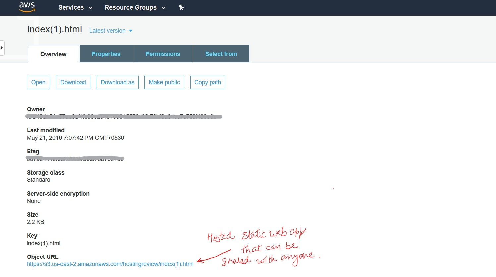
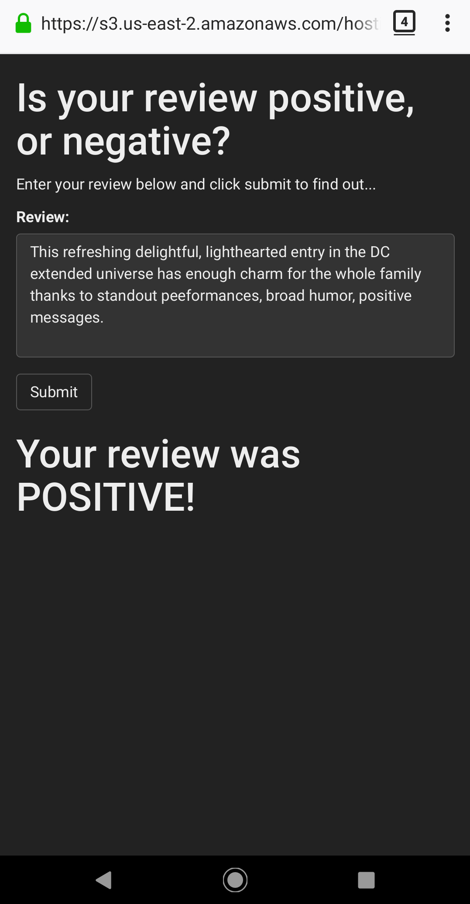

# Movie-review-sentiment-analysis-using-Sagemaker

A simple web app which interacts with a deployed recurrent neural network performing sentiment analysis on movie reviews.

## Project Outline

1. Download the imdb dataset.

2. Prepare and Process the data by shuffling positive and negative reviews together. Make a vocabulary dictionary and tokenize the reviews to int words.

3. Upload data to Amazon S3.

4. Build and train LSTM Classifier in Pytorch.

5. Test the train method with some data.

6. Use Sagemaker's Pytorch facility by making a python script for train method and set that script as parameter "entry point" for the estimator.

7. Deploy the model by creating an endpoint.

    TESTING
   - Use deployed endpoint predictions to test the model.
   - Testing by writing your own review.
   
8. Write inference code as a python script 'predict.py' in the serve directory. This directory also contains model.py, utils.py & requirement.txt which tells sagemaker what python libraries are required.

9. Delete previous test endpoints and deploy a new one that directs sagemaker to 'serve' directory and 'predict.py' script. Test the accuracy again with some data.

10. Working on the AWS Console :
    - Setting up Lambda function which is used to send preprocessed data to the endpoints.
    - Setting up API Gateway and adding that to the web app file.
    
11. Hosting your web app with S3
    - Firstly, create a S3 bucket with a name same as you want your domain name to be.
    - Configure your S3 Bucket for static website hosting by going to properties.
      Select "Static website hosting" >> "use this bucket to host a website".
    - Enter your web app document as "Index Document".
    - Go to "Permissions" & unblock all the Public Access Policies in the Public Access Settings.
      Update your bucket policy so as to share with anyone in the world.
    - (Optional) You can map your desired domain name to the S3 website URL.
    - Navigate to your S3 Bucket and upload your entire static website directory in our case just the web app document.
      Keep every other thing as default.
      
      
 
 12. You can share the url with your friends and family to play with your web app.
 
 ## Caution
 
 - Never forget to delete the endpoints, if you are not using it as it incurs cost for running your endpoints.
 ```
 predictor.delete_endpoint()
 ```
 - Using S3 storage also incurs cost but it's relatively very less and depends on amount of files you have there.
 
 - Don't put your private files in buckets with public access.
 
 ## Result
 
 
 
 
 
 ### Hosted web app on a smartphone
 
 
 


[Sentiment Analysis Web App](https://github.com/udacity/sagemaker-deployment/tree/master/Project) is a notebook and collection of Python files taken from the udacity . The result is a deployed RNN performing sentiment analysis on movie reviews complete with publicly accessible API and a simple web page which interacts with the deployed endpoint.
